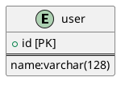

## チーム開発のためのマッチングプラットフォーム「developeer」

__URL：__

## ER図



## インフラ構成


## 環境構築

1. Clone GitHub repository your local configuration
```bash
$ git clone https://github.com/tn-528hz/developeer.git
```

2. Install Python Library
```bash
$ pip install -r requirements.txt
```

3. Runserver your localhost
```bash
$ python manage.py runserver
```
